<p align="center">
  
</p>

<h1 align="center">Clawd Desktop Pet</h1>

<p align="center">
  A pixel-art Linux desktop companion with 90+ animated SVG scenes, autonomous routines, and external hook support.
</p>

<p align="center">
  <a href="README.zh-CN.md">简体中文</a>
</p>

<p align="center">
  
  
  
  
</p>

## Demo

### Core Workflow

<table>
  <tr>
    <td align="center"><strong>Idle</strong><br></td>
    <td align="center"><strong>Thinking</strong><br></td>
    <td align="center"><strong>Typing</strong><br></td>
  </tr>
  <tr>
    <td align="center"><strong>Building</strong><br></td>
    <td align="center"><strong>Juggling</strong><br></td>
    <td align="center"><strong>Conducting</strong><br></td>
  </tr>
</table>

### Reactions & Daily Life

<table>
  <tr>
    <td align="center"><strong>Notification</strong><br></td>
    <td align="center"><strong>Happy</strong><br></td>
    <td align="center"><strong>Error</strong><br></td>
  </tr>
  <tr>
    <td align="center"><strong>Carrying</strong><br></td>
    <td align="center"><strong>Sweeping</strong><br></td>
    <td align="center"><strong>Sleeping</strong><br></td>
  </tr>
</table>

### Mini Mode

<table>
  <tr>
    <td align="center"><strong>Enter</strong><br></td>
    <td align="center"><strong>Idle</strong><br></td>
    <td align="center"><strong>Peek</strong><br></td>
  </tr>
  <tr>
    <td align="center"><strong>Alert</strong><br></td>
    <td align="center"><strong>Happy</strong><br></td>
    <td align="center"><strong>Crabwalk</strong><br></td>
  </tr>
</table>

Demo GIFs are referenced from the original capture set so the public repo stays text-only and easy to publish through the GitHub API.

## Features

- 90+ handcrafted SVG scenes and 18 preview GIFs
- Autonomous behavior engine with calm routines, playful bursts, and screen-edge hiding
- Cursor eye tracking, jelly body motion, and per-state hat attachment
- Rich interactions: dragging, hover reactions, click reactions, petting, and costume swaps
- Linux desktop integrations for notifications, X11 keyboard activity, tray controls, and mini mode
- Local HTTP API plus a bundled hook bridge for external event sources
- English and Simplified Chinese documentation

## Quick Start

```bash
git clone https://github.com/zgyk4167/clawd-desktop-pet.git
cd clawd-desktop-pet
npm install
npm start
```

Build Linux packages:

```bash
npm run build:linux
```

## Optional Hook Bridge

Generate or merge a JSON hook config file with the bundled commands:

```bash
CLAWD_HOOKS_SETTINGS="$HOME/.config/clawd/hooks.json" node hooks/install.js
```

Set `CLAWD_HOOKS_SETTINGS` to any compatible JSON hook config path if you want the installer to merge the entries into an existing setup.

## Local API

Send state updates directly to the pet:

```bash
curl -X POST http://127.0.0.1:23333/state \
  -H "Content-Type: application/json" \
  -d '{"state":"working","session_id":"demo","event":"PreToolUse"}'
```

You can also pass `"svg":"clawd-react-sparkle.svg"` to force a specific animation for demos.

## How It Works

```text
desktop notifications / keyboard activity / external hook events
  -> hooks/clawd-hook.js or src/main.js monitors
  -> local HTTP server on 127.0.0.1:23333
  -> state resolver + behavior engine
  -> renderer-rich.js handles transitions, jelly motion, hat attachment, and hover reactions
```

## Project Structure

```text
src/
  main.js          # state machine, Linux integration, tray, local API
  behavior.js      # autonomous behavior engine and roaming logic
  renderer-rich.js # transitions, reactions, hat + jelly physics
  renderer.js      # renderer helpers used by the desktop window
  preload.js       # IPC bridge
  index.html       # DOM shell
  styles.css       # layout and animation styling
hooks/
  clawd-hook.js    # stdin-to-HTTP bridge for external hook runners
  install.js       # merges hook commands into a JSON hook config
assets/
  svg/             # pixel-art SVG states
```

## Manual Testing

```bash
bash test-behavior.sh
bash test-demo.sh 4
bash test-mini.sh 4
```

Notes:
- Notification monitoring uses Freedesktop D-Bus.
- Keyboard activity sensing currently uses X11.

## Credits

- Based on [clawd-on-desk](https://github.com/rullerzhou-afk/clawd-on-desk) by [@rullerzhou-afk](https://github.com/rullerzhou-afk)
- Pixel-art reference from [clawd-tank](https://github.com/marciogranzotto/clawd-tank) by [@marciogranzotto](https://github.com/marciogranzotto)

## License

MIT. See [LICENSE](LICENSE).
